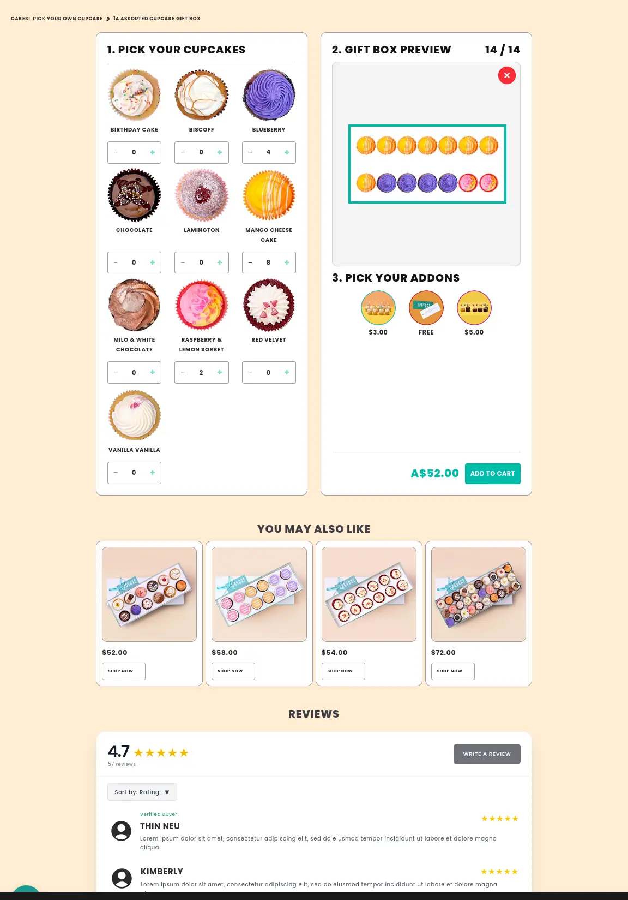
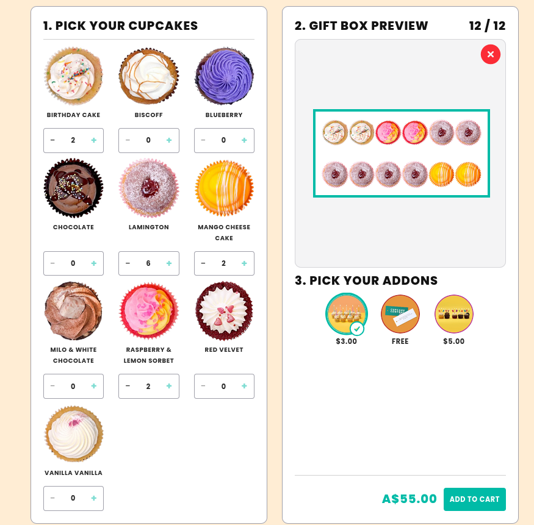
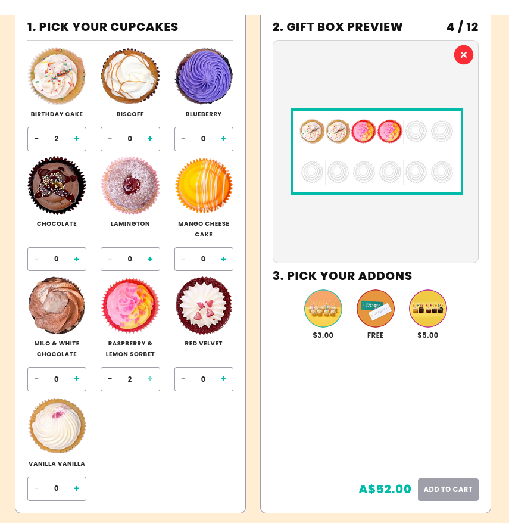

# Cupcake Central Test

## The Submission

  
  
  

- [Link to the Page](https://cupcake-central-test.myshopify.com/pages/test-candidate-10)

## The Test

- Level: Mid-Senior	Submission
- Estimated Time: Within 48 hours  (2 - 6 Hours	Test Type)
- [Wireframe link](https://xd.adobe.com/view/c71a2b8c-11f6-44cf-a614-4bef49b9c844-9249/)
- [Wireframe link](https://xd.adobe.com/view/ac53c40a-4a95-48ab-9d9c-2e5484a4cde2-f900/)

### 2. Task Requirements

Complete all the following requirements. Refer to the CCdev-test_2026 file for full context on the expected outcome.
 
#### Build your own dozen - cupcake box builders
- Create a Shopify product page called "Build Your Own Dozen"
- Fixed price (e.g. $72) - no variants required
- Display a grid of cupcake flavors with circular images and names
- Each flavor has - / quantity / + controls
- Live counter showing "X of 12" that updates in real time
- A 12-slot gift box preview that fills as cupcakes are selected
- Add-ons section (ribbon, candles, bag) below the box preview
- Add to Cart button disabled until exactly 12 cupcakes are selected
- Flavor selections passed to cart as Shopify line-item properties

#### Logic requirements
- \+ buttons must disable automatically when total reaches 12
- \- buttons must disable individually when the flavor count is at 0
- Reset / start over clears all selections without a page reload
- No page reloads at any point - all state handled in JavaScript
 
#### Technical requirements
- Built using Shopify Liquid (theme section or template)
- Flavor data stored in metafields or metaobjects - not hardcoded HTML
- Vanilla JS only - Alpine.js is acceptable. No jQuery, Vue, or React
- No third-party apps (no Bold, Infinite Options, or similar)
- The number 12 must not be hardcoded - code should scale to 6 or 24
 
### 3. Required Output

Provide a clear output for each of the following when submitting your work.
 
1. A working Shopify preview link to the built page
2. Screenshots or a screen recording of the completed builder
3. GitHub repository links with your full theme code
4. A short written note explaining how you structured the flavor data
5. Any tradeoffs you made and the reason for each decision
 
### 4. Logical Questions

Answer each question in writing as part of your submission. There are no trick questions - we want to understand how you think.

#### Q1 - State management: How did you manage the selection state (flavor counts, total, box preview) across the page? Walk us through your approach and why you chose it.

I decided to manage the state with a single global Javascript variable (“dataRaw”) and then track all changes to the object with a proxy constructor. Changes to the data is then piped into a switch statement and then the relevant functions for each property are called. This mimics the reactivity seen in things like SolidJS.

The reason I like this method is that it scales well and remains performant. Scales in the sense that adding functionality such as additional checks and calculations doesn’t break existing code. You can work with a property in isolation and not worry about how that might affect the greater ecosystem. It also is quite performant because it only runs the calculations required for one particular property and if that property changes nothing else, then the computations end there.

In terms of the properties themselves:
- Cupcake info is best kept in a map, since adding and removing elements becomes trivial, which is what happens 95% of the time.
- Addons can only be selected once, so a set makes sense. Easy to add and remove and remain unique.
 
#### Q2 - Edge cases: Without being told, what edge cases did you identify and handle? List them and explain how each one is handled in your code.

- **Reloading from storage or resetting caused the user’s screen to be in an unusual state.** Since there are two states, one in HTML and the other in JS, keeping them in sync can be a little tricky. I had two ways to resolve this; go through all checks each time the user interacted with the screen or separate the full screen updates (all elements) from the minute updates (just the button that was clicked). I chose to separate the updates since the reset and loading for storage updates are seldom run, so putting that in the “hot path” so to speak wouldn’t be good for user experience. This does come with a maintenance burden, since now changing the code requires a better understanding of what it’s doing.
- **Reloading from storage if the gift box size has changed.** If staff change the gift box size while the site is live and the user reloads, they’ll be in a state where they might have exceeded the gift box max size. I decided to simply cull the cupcakes over the current max size to resolve this.
- **Stock changing while the user is creating their box.** There were two ways to go about this; either keep the user in sync with current stock levels or take a snapshot of the stock when they loaded the page and base it off that. I chose the latter because of how it would feel as a user. Imagine choosing a cupcake, then removing it and then being unable to re-add it again because it’s out of stock. So instead it would be better to just have a fixed buffer to the stock levels, though this would be more of a management issue to settle.

 

### Q3 - Shopify data structure: How did you store the cupcake flavor data in Shopify? Why did you choose that approach (metafields, metaobjects, JSON, or other)?

I decided to go with Metaobjects because:
- It can be reused across the site and changes are easy to do in one centralised location.
- Doesn’t require one of the Shopify developers to do it in liquid or json since the UI can be used by pretty much anyone.
- Linking to actual products would be easy.
- Note: I also added a dummy stock variable which should be replaced with a link to the actual product (which I couldn’t do due to a lack of access to the products page).

### Q4 - Scalability: If the client wanted to change this to "Build Your Own 6" or "Build Your Own 24", what would need to change in your code? How many minutes would that take?

They’d need to change the Box Quantity and Cupcakes per row of the box setting in the Theme Editor template. So less than 30 seconds and wouldn’t need to code.
 
### 5. Bonus Challenges (Optional)

These are not required but will be considered in the final score. Each bonus is worth 5 points.
 
####	Challenge	Points
1.	Drag and drop flavors into the 12-slot box on desktop	+5 pts
2.	Flavor limits driven by live Shopify inventory stock levels	+5 pts
3.	Selected add-ons passed to cart as line-item properties with correct pricing	+5 pts
4.	Selections persist on page refresh using local Storage	+5 pts

### 6. Scoring Rubric
 
|Category|What we look for|Points|
|---|---|---|
|Core functionality|Grid, counter, box preview, cart payload|30 pts|
|Edge case handling|Button locking, gated Add to Cart, reset|25 pts|
|Shopify structure|Liquid, metafields or metaobjects, scalable setup|20 pts|
|UX quality|Mobile responsive, no reloads, clear messaging|15 pts|
|Code quality|Readable, commented, 12 not hardcoded|10 pts|

- Pass mark: 60 / 100   
- Senior candidate target: 80+   
- Max with bonuses: 120

Good luck! If you have any questions about the brief, please reach out before starting.

We look forward to reviewing your work.
 
Cupcake Central Bakery - Developer Assessment
